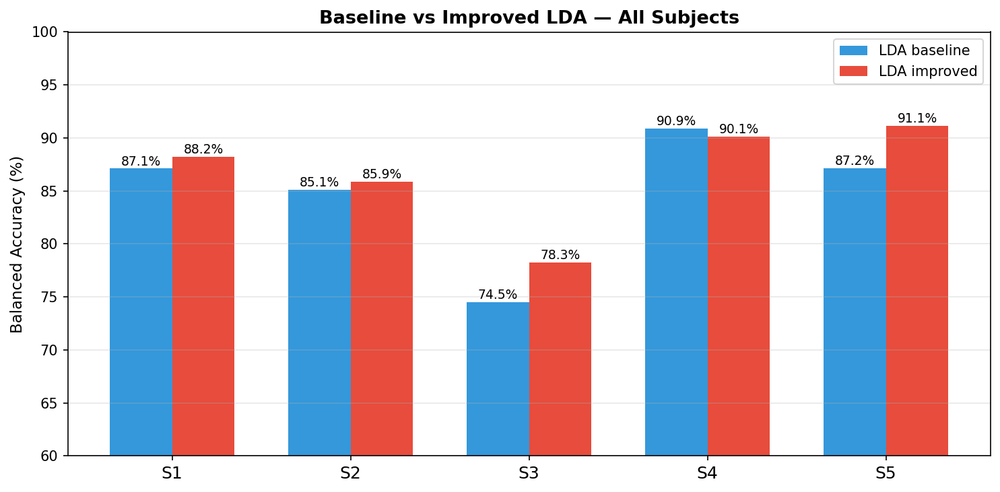
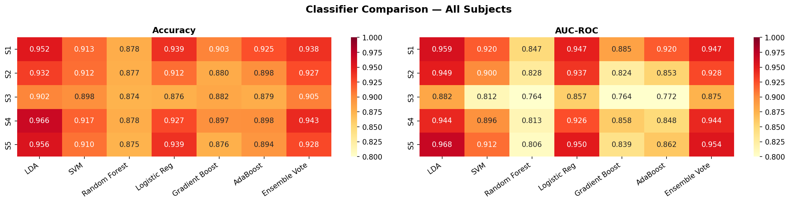
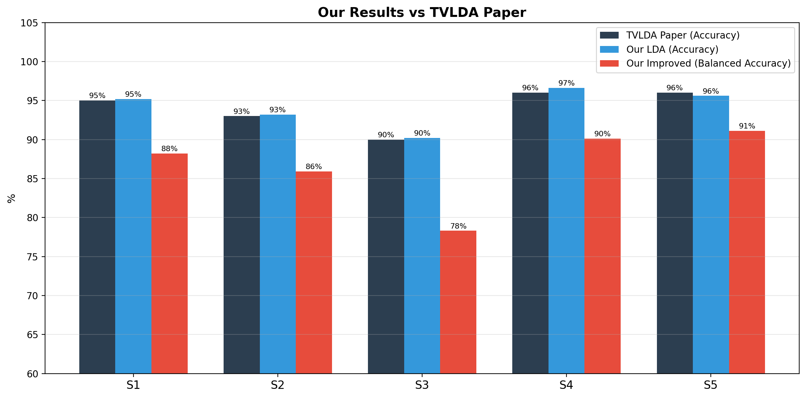

# P300 Speller — EEG Data Analysis
### BR41N.IO Spring School Hackathon 2026 | g.tec medical engineering

---

## Overview

This project was developed during the **BR41N.IO BCI Designer's Hackathon 2026**,
organized by (https://www.gtec.at) as part of the
BCI & Neurotechnology Spring School (April 20–29, 2026).

The hackathon brought together participants from over 140 countries to build
Brain-Computer Interface applications within 24 hours. Our team worked on the
**P300 Speller Data Science challenge** — analyzing EEG recordings from 5 healthy
subjects using a P300-based BCI speller system.

A P300 speller is a Brain-Computer Interface that allows people to type using only
their brain signals, with critical applications for patients with ALS and other
motor disabilities. When the target character flashes on screen, the brain generates
a distinctive positive wave ~300ms later — the **P300 component** — which the system
detects to determine the intended character.

---

## Dataset

5 healthy subjects (S1–S5) recorded using the **Unicorn Brain Interface** (g.tec):

| Parameter | Value |
|-----------|-------|
| Channels | 8 (Fz, Cz, P3, Pz, P4, PO7, PO8, Oz) |
| Sampling rate | 250 Hz |
| Electrode type | Wet |
| Paradigm | Row-Column flashing |
| Epochs per subject | 1200 (150 target, 1050 non-target) |
| Class ratio | 1:7 (target:non-target) |

> ⚠️ Data files (.mat) are not included due to licensing restrictions.
> The original dataset was provided by g.tec medical engineering
> as part of the BR41N.IO Hackathon 2026.

---

## Pipeline

### Preprocessing

| Step | Method | Parameters |
|------|--------|------------|
| Bandpass filter | Butterworth order 4, zero-phase (filtfilt) | 0.5–30 Hz |
| Epoching | Fixed window at trigger onsets | 0–0.8s |
| Resampling | Polyphase | 250 Hz → 64 Hz |
| Baseline correction | Mean subtraction | First 100ms |
| Artifact rejection | Peak-to-peak threshold | 150 µV |

**Key decisions:**
- Tried MNE FIR filter first — switched to Butterworth for speed with equivalent ERP preservation
- Epoch window: started with -0.1 to 0.7s, switched to 0–0.8s since baseline correction handles the offset
- Artifact threshold: tested 100 µV (too aggressive, lost 30%+ of S1 epochs), settled on 150 µV
- Resampling to 64 Hz: sufficient by Nyquist for 30 Hz filtered signal, 4× dimension reduction

### Classification

- **Spatial filtering:** XdawnCovariances + TangentSpace (Riemannian geometry via pyriemann)
- **Baseline classifier:** LDA (solver=eigen, shrinkage=auto — Ledoit-Wolf)
- **Improved pipeline:** + StandardScaler + PCA (95% variance) + target oversampling
- **Evaluation:** 5-fold stratified cross-validation, balanced accuracy
- xDAWN fitted inside each fold to prevent data leakage

### Classifiers compared
LDA, SVM, Random Forest, Logistic Regression, Gradient Boosting, AdaBoost, Ensemble Vote

> KNN and Naive Bayes were tested and removed — KNN showed AUC as low as 0.585,
> Naive Bayes violates EEG feature independence assumptions.

---

## Results

### Artifact Rejection

| Subject | Kept | Removed |
|---------|------|---------|
| S1 | 1119 | 81 |
| S2 | 1184 | 16 |
| S3 | 1179 | 21 |
| S4 | 1200 | 0 |
| S5 | 1092 | 108 |

### Baseline vs Improved LDA (Balanced Accuracy)

| Subject | Baseline | Improved | Gain |
|---------|---------|---------|------|
| S1 | 87.1% | 88.2% | +1.1% |
| S2 | 85.1% | 85.9% | +0.7% |
| S3 | 74.5% | 78.3% | +3.7% |
| S4 | 90.9% | 90.1% | -0.8% |
| S5 | 87.2% | 91.1% | +4.0% |

### Comparison with TVLDA Paper (same dataset)

| Subject | Paper (Accuracy) | Our LDA (Accuracy) | Our Improved (Bal. Acc.) |
|---------|-----------------|-------------------|--------------------------|
| S1 | ~95% | 95.2% | 88.2% |
| S2 | ~93% | 93.2% | 85.9% |
| S3 | ~90% | 90.2% | 78.3% |
| S4 | ~96% | 96.6% | 90.1% |
| S5 | ~96% | 95.6% | 91.1% |

> Our standard accuracy matches the paper. Balanced accuracy is stricter —
> it accounts for the 1:7 class imbalance and penalizes bias toward the majority class.





---

## Key Observations

- **S4** is the best subject — zero artifacts, strongest P300, highest accuracy (96.6%)
- **S3** is the hardest — weakest P300 visible from ERP stage, lowest accuracy
- **LDA consistently outperforms** all other classifiers — consistent with TVLDA paper
- Improved pipeline helps most for noisy subjects (S3: +3.7%, S5: +4.0%)

---

## Requirements

```bash
pip install -r requirements.txt
```

---

## Usage

1. Obtain the dataset from g.tec medical engineering (hackathon participants only)
2. Place `.mat` files in `/content/` if using Colab, or update `DATA_DIR` in the config cell
3. Run `P_300_SPELLER.ipynb` cell by cell

---

## Reference

Gruenwald et al., *"Improving P300 Speller Performance by
Time-Variant Linear Discriminant Analysis"*,
g.tec medical engineering GmbH, 2026.

---

## Certificate

Completed as part of the **BR41N.IO BCI Designer's Hackathon 2026**,
organized by g.tec medical engineering during the
BCI & Neurotechnology Spring School (April 20–29, 2026).
